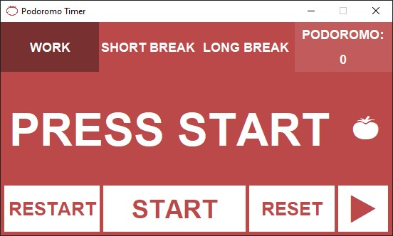
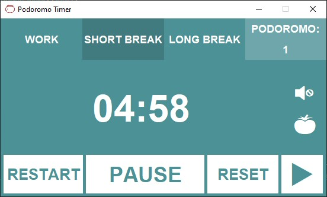
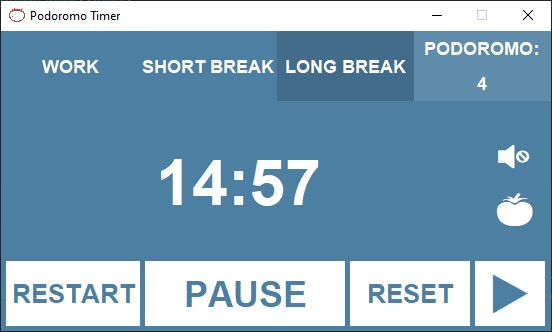
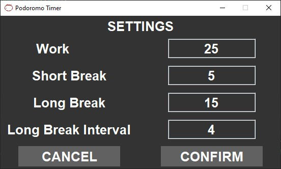

# PODOROMO TIMER 🍅

## Images

    
    
    
    
    

## Dependencies
### TinySound 

## Using Podoromo Timer
- .exe file: [bin](bin).
- .jar file: [out/artifacts/PodoromoTimerProject_jar](out/artifacts/PodoromoTimerProject_jar)
- Source code: [src/main/java/com/podoromotimer](src/main/java/com/podoromotimer).

