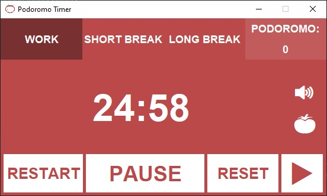

# PODOROMO TIMER 🍅

### A simple Java-based Pomodoro Timer
 Developed by Butterfly Hunter (Thợ săn bướm)

## Introduction
This simple application is developed by myself just to help my study because:
- I can't 100% focus when study for a long time.
- I don't want to use the online timer which I consider consumes a lot of usage of Ram and Cpu.
- Improve my Java Swing skill
- The amazing design on [pomofocus.io](https://pomofocus.io/).

## Images

    
    
    
    
    

## About
This application is **Podoromo Timer**, which uses **Pomodoro Technique**. It breaks work into intervals, typically 25-mins in length and separated by breaks. 

The GUI of this application is developed based on **_[pomofocus.io](https://pomofocus.io/)_** design using <b>Java Swing</b>. 

This application used **_TinySound_** to play sounds. **_TinySound_** is a simple library to play or manage sounds in Java.

## !!!!!!This project is not developed for commercial purposes.!!!!!!

##### The basic steps are:
1. Choose a single task to focus on.
2. Set a timer for 25 minutes and work only on your selected task.
3. After 25 minutes take a five-minute break.
4. Repeat steps 1-3 four times.
5. Take a longer break of about 15 to 30 minutes.  

##### Functions:
- Pause / resume session for having a temporary break.  ⏯
- Skip the current session ⏭
- Reset all 🔄
- Add sounds when clicked and between changing session 🔊
- Mute / unmute sounds 🔊/🔇
- Change theme color corresponding to the session 🟥🟩🟦
- Modify the duration of sessions, long break interval 🔧
- Auto validates the input value ✅

## Dependencies
### TinySound 

## Prerequisites
Before you continue, ensure you meet the following requirements: 
- You have installed at least **Java 8**
- You have installed **Intellij** to use **Swing GUI Designer**

## Using Podoromo Timer
- .exe file: [bin](bin).
- .jar file: [out/artifacts/PodoromoTimerProject_jar](out/artifacts/PodoromoTimerProject_jar)
- Source code: [src/main/java/com/podoromotimer](src/main/java/com/podoromotimer).

# Contact
* Email: [2251052045huy@ou.edu.vn](mailto:2251052045huy@ou.edu.vn) || [huykhongcan04@gmail.com](mailto:huykhongcan04@gmail.com)
* GitHub: [github.com/huywindear004](https://github.com/huywindear004)